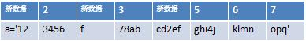

js增量更新算法设计
==================

用localstorage来存储js文件我们已经减少了很多不必要的304 http请求，但是对于版本更新的时候，我们还是必须全量下载整个js文件。然而大多数在快速迭代开发的网站中，我们修改js往往只是修改很少的一部分内容，这就造成了大部分js数据的下载是浪费的，接下来我们将设计一个算法来解决这个问题。
首先通过localstorage我们能获取上一个版本的js内容，那么只要我们通过一种办法计算出来我们本次更新在原有的js内容上什么位置更新了什么内容，那么我们就可以根据这个数据和js上个版本的数据合并生成一个新版本的js.
先来看下整个增量更新的流程：

1.先将旧文件按一定长度分成多个块，计算md5值放入一个map，如图1所示

图1.旧文件按照一定长度切分并编号:

2.在新文件上进行滚动md5查找，如果找到匹配的则记录块号，如果没找到则块往前移动1个字符，并把上个字符压入新数据块,然后扫描下一块，最终得到一个新数据和数据块号的组合的增量文件（这一步可以用上线js时用的打包工具或者请求js时用服务器程序实时计算出来）如图2所示

图2.新文件滚动查找后由旧数据块号和新更新数据组成

最终增量文件表示如下:
> 1,data1,2,3,data2,4,5,6

进一步合并顺序块得到:
> [1,1],data1,[2,2],data2,[4,3]

3.客户端根据旧文件的chunk数据和第二部生成的增量更新数据，我们可以得出新版本数据由如下数据组成：
> chunk0 + data1 + chunk1 + chunk2 + data2 + chunk3 + chunk4 + chunk5

以 s='12345678abcdefghijklmnopq' 修改为 a='123456f78abcd2efghi4jklmnopq' 为例
设块长度为4则，源文件可分割为如下chunk数据(第一行块号，第二行数据),如图3所示：

通过滚动查找比对，得到新的文件构成如图4所示：

图4.实例新文件块号和新数据结构:

最终增量文件表示如下数组:
> ["a='12",2,"f",3,"cd2ef",5,6,7]

进一步合并顺序块，可用一个js数组表示为
> ["a='12",[2,1],"f",[3,1],"cd2ef",[5,3]]

所以新数据为:
> a="a='12",+chunk2+”f”+chunk3+"cd2ef",+chunk5+chunk6+chunk7=a='123456f78abcd2efghi4jklmnopq' 

合并代码如清单2所示.清单2.合并代码函数

//source是上一个版本内容，trunkSize是块大小，checksumcode是两个版本间的增量文件数组
>	var rsyncjs=function(source,trunkSize,checksumcode){
		var strResult="";
		for(var i=0;i<checksumcode.length;i++){
			var code=checksumcode[i];
			if(typeof (code)=='string'){
			 strResult+=code;
			}
			else{
			var start=code[0]*trunkSize;
			var len=code[1]*trunkSize;
			var oldcode=source.substr(start,len);
			strResult+=oldcode;
			}
		}
		return strResult;
	}

通过这个算法，我们可以基本达到修改哪些内容就下载哪些内容的目的，大大减少下载流量。
