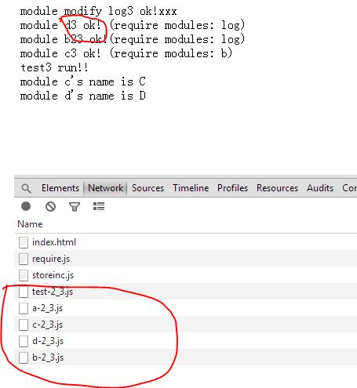

js本地存储和增量更新requirejs插件使用
=====================================

用增量更新这个算法写了一个requirejs插件storeinc,使用方法如下:
首先使用修改后的r.js来进行混淆打包，构建配置如下(请看js/requirejs下的build.js):
    ({
        appDir: "../demo/js",
        baseUrl: "./",
        dir: "../demo/dist",//不走增量更新的文件存放路径
        paths: {
            log: "a",
            storeinc:"../storeinc"//这里插件
        },
        storeinc: true,//说明走storeinc插件
        storedir: "../demo/storeincdist",//混淆后的js存放路径，包括增量文件
        lastver:"2", //上一个版本号，如果没有说明是第一次打包
        ver:'3',//新版版本号
        chunkSize:12,//增量更新块号
        modules: [
            {
                name: "test",
                exclude: [
                    "log","b","c","d","storeinc"
                ]
            },
            {
                name: "log",
                exclude: [
                   "storeinc"
                ]
            },
            {
                name: "b",
                exclude: [
                    "storeinc","log"
                ]
            },
        ]
    })

运行node r.js -o build.js

第一次运行时 node r.js ：
> lastver:"1", //上一个版本号，如果没有说明是第一次打包
> ver:'2',//新版版本号

然后到js目录修改各个源文件，第二次运行时：
> lastver:"2", //上一个版本号，如果没有说明是第一次打包
> ver:'3',//新版版本好号

然后在index.html里面加入如下代码（请看js/requirejs下的index.html）:
    
    //主资源下载，记住storeinc!前缀来启用插件
    
    
另外需要在业务里的各个依赖前都加上storeinc!如test.js：
    require(['storeinc!log','storeinc!c','storeinc!d'], function (log, modC, modD) {
        log.write('test3 run!!');
        log.write('module c\'s name is ' + modC.name);
        log.write('module d\'s name is ' + modD.name);
    });

接下来看下效果:
第一次我们把index.html里的ver项配置设为2,然后访问index.html,结果如下图所示:
 

第二次我们把index.html里的ver项配置设为3,说明这次需要的是版本为3的内容，结果如下图所示:

说明访问的是增量文件，已经达到增量更新的目的